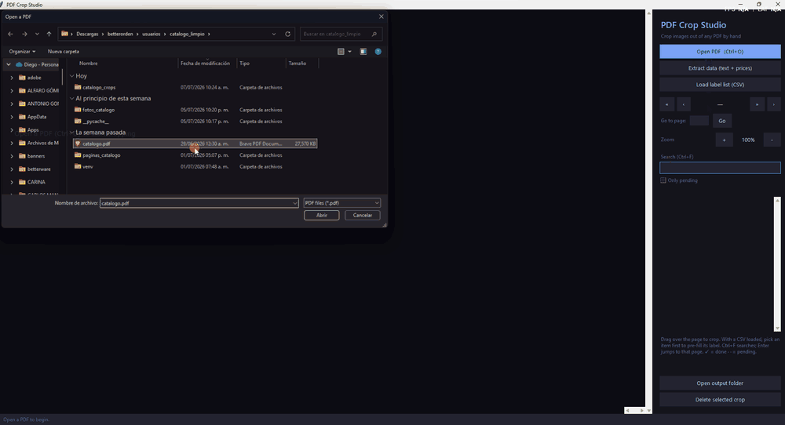

# PDF Crop Studio

**Crop images out of any PDF, by hand, with pixel precision.**

Automatic PDF image extractors (XObject dumps, "smart" croppers, LLM vision
tools) constantly get it wrong: they merge two pictures into one, cut off the
bleed, grab a background rectangle instead of the product, or miss vector art
entirely. PDF Crop Studio takes the opposite approach — it renders each page at
high resolution and lets **you** drag the exact rectangle you want. What you
select is what you get.

Built for catalogs, magazines, datasheets, zines, scanned docs — any PDF where
you need clean image cutouts and the automatic tools keep failing you.



*Open a PDF → **Extract data** → drag over a product → the label and price
auto-fill from the page text → **Save**.*

## Features

- 📄 **Open any PDF** and flip through pages, rendered crisp at 3× zoom.
- 🔍 **Zoom & pan** with the mouse wheel to line up the perfect selection.
- 🖱️ **Drag to crop** — live pixel dimensions while you drag.
- 🪄 **Auto-label from the PDF** — hit **Extract data** and every crop's label
  (and price, when detected) is pre-filled from the text inside or just below
  your selection. No CSV, no retyping.
- 🎯 **Key info only** — toggle "Only items with a price" to keep real
  products/entries and drop greetings, headers and stray numbers.
- 🔢 **Works with code-based catalogs** — for catalogs whose items have a
  product code instead of a name (`126031`, `W2155`), the code becomes the
  entry and is detected on crop; no name required.
- 🔎 **OCR fallback (Windows)** — scanned or flattened PDFs with no text layer
  are read with the OCR built into Windows 10/11: whole pages during
  **Extract data**, and the exact crop region when you make a crop. Product
  codes (`126031`, `W2155`) are detected and pre-fill the ID field.
- 🗄️ **Export to SQL** — one click writes a ready-to-load `.sql` (id, label,
  price, category, page, image path) for all your crops.
- 🌐 **English & Spanish** — switch the whole UI language from the top-right;
  your choice is remembered.
- 🏷️ **Label each crop** with an optional ID, price and category.
- 📋 **Optional CSV list** — or load your own list of items (SKUs, figure
  numbers, names) to tag crops against and track what's still pending.
- 💾 **Exports PNGs + `manifest.json`** with page number and normalized
  bounding boxes, ready for any downstream pipeline.
- ⏯️ **Resumable** — close it and pick up exactly where you left off.
- 🌙 Clean dark UI, no cloud, no account, everything stays on your machine.

## Install & run

Requires Python 3.9+.

```bash
git clone https://github.com/<your-user>/pdf-crop-studio.git
cd pdf-crop-studio
pip install -r requirements.txt
python run.py
```

Or open a PDF straight away:

```bash
python run.py path/to/catalog.pdf
```

Prefer a double-click, no-Python experience? See [build_exe.md](build_exe.md)
to build a standalone Windows `.exe`.

## How it works

1. **Open PDF** (or pass one on the command line).
2. *(Optional)* Click **Extract data** — the app reads the PDF's text layer so
   crops can auto-fill their label and price from nearby text.
3. Navigate to a page; zoom in with the wheel until the image is comfortable.
4. **Drag a rectangle** over the region you want. Release to confirm.
5. The **label** (and price) come pre-filled from the text under your selection —
   just confirm or tweak, then hit **Save**.
6. The crop is written to `<pdfname>_crops/crops/<key>.png` and recorded in
   `<pdfname>_crops/manifest.json`.

### Output

Everything lands in a folder named after your PDF, next to it:

```
mycatalog.pdf
mycatalog_crops/
├── project.json        # session state (so you can resume)
├── manifest.json       # flat list of all crops, for downstream tools
└── crops/
    ├── crop_0001.png
    ├── 10432.png       # named after the ID you typed, when you provide one
    └── ...
```

Each `manifest.json` entry looks like:

```json
{
  "key": "10432",
  "id": "10432",
  "label": "Stainless steel thermos 1L",
  "category": "Kitchen",
  "price": 199.9,
  "page": 14,
  "bbox_norm": { "x0": 0.11, "y0": 0.32, "x1": 0.48, "y1": 0.71 },
  "bbox_px": { "x0": 594, "y0": 1728, "x1": 2592, "y1": 3834 },
  "width": 1998,
  "height": 2106,
  "file": "crops/10432.png",
  "source_pdf": "mycatalog.pdf"
}
```

`bbox_norm` is resolution-independent (0–1), so you can re-crop the same region
from a higher-res render later if you need to.

### Auto-labelling from the PDF text (Extract data)

Click **Extract data (text + prices)** after opening a PDF. The app scans the
document's text layer, remembering where every line sits on the page. From then
on, when you drag a crop:

- the **label** is pre-filled with the text that falls inside your selection (or
  the caption right below it, e.g. a product name under a photo);
- if a nearby line looks like a **price** (`$`, `€`, `MXN`, …), it's parsed and
  filled into the price field too.

The scan is cached next to your crops as `extracted.json`, so reopening the
same PDF is instant. You can still edit any field before saving — nothing is
forced.

#### What about scanned PDFs with no text layer?

Lots of catalogs are just images inside a PDF — there is no text to extract.
On **Windows 10/11**, PDF Crop Studio falls back to the OCR engine built into
the OS (installed with `pip install winocr`, no cloud involved):

- **Extract data** OCRs every page that has no text layer (you'll see the
  progress in the status bar).
- When you **drag a crop** on such a page, the app OCRs just your selection
  plus the caption area below it — small region, much higher accuracy — and
  pre-fills the label, price and even the product code into the ID field.
- Common OCR digit mistakes in prices are fixed automatically
  (`$ I,839.OO` → `$1,839.00`).

Heads-up: OCR quality depends on the source resolution. Crisp digital PDFs
(≈150 DPI+) read great; a low-resolution rip (e.g. a 72 DPI catalog saved as a
flat image) can only be read partially — the app tells you when it detects one,
and you fix the odd wrong digit by hand after cropping.

### Export to SQL

When you're done, click **Export to SQL** to write a single `.sql` file with one
row per crop:

```sql
CREATE TABLE IF NOT EXISTS products (
  id TEXT, label TEXT, price REAL, category TEXT, page INTEGER, image TEXT
);
INSERT INTO products (id, label, price, category, page, image) VALUES
  ('10432', 'Mesa Roll', 1800, NULL, 1, 'crops/10432.png');
```

The `image` column points at the PNG in the `crops/` folder next to the `.sql`,
so the file loads straight into SQLite, Postgres or MySQL.

### Language

Switch the interface between **English** and **Español** with the `EN` / `ES`
buttons in the top-right corner. Your choice is saved for next time.

### Using a CSV label list (optional)

Load a CSV to tag crops against a known list and track progress. The columns
are auto-detected; a header like `id,label,category` works, and so does a plain
two-column `id,name` file with no header.

```csv
id,label,category
10432,Stainless steel thermos 1L,Kitchen
10433,Glass food container set,Kitchen
```

With a list loaded, pick an item in the sidebar before you drag — its label is
pre-filled, and it's marked ✓ once you've cropped it. "Only pending" hides the
ones you've already done.

## Mouse & keyboard

Two mouse modes, toggled with the **Crop / Pan** button in the sidebar:

- **Crop mode** (default): left-drag draws a crop rectangle.
- **Pan mode**: left-drag moves the page around.

In *either* mode you can also pan by **dragging with the middle mouse button**
or by **holding `Space` and dragging** — handy for a quick nudge without
leaving crop mode.

| Shortcut            | Action                          |
|---------------------|---------------------------------|
| `Ctrl+O`            | Open a PDF                       |
| `PageUp` / `PageDown` | Previous / next page           |
| Mouse wheel         | Scroll up / down                 |
| `Shift` + wheel     | Scroll left / right              |
| `Ctrl` + wheel      | Zoom at cursor                   |
| `Ctrl` + `+` / `-`  | Zoom in / out                    |
| Middle-drag / `Space`+drag | Pan the page              |
| `Ctrl+F`            | Focus search                     |
| `Enter` (in search) | Jump to the highlighted item's page |
| `Delete` (in list)  | Delete the selected crop         |
| `Esc`               | Cancel the current selection     |

## Roadmap

Ideas for contributions (PRs welcome!):

- Export crops as JPG/WebP with quality settings
- Batch re-export at a chosen DPI from saved `bbox_norm`
- Rotate / straighten before saving
- macOS & Linux packaged builds
- Snap-to-content edge detection as an *assist* (never automatic)

## License

MIT — see [LICENSE](LICENSE). Do whatever you like with it.
